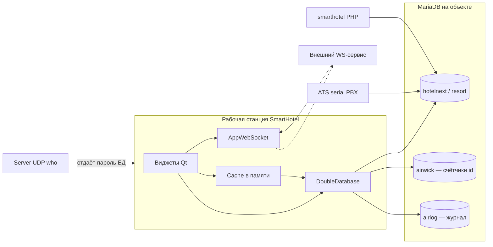

# 1. Текущее состояние

## 1.1. Что это за система

SmartHotel — настольная PMS для одного отеля на одну базу. В коде есть фронт-офис (шахматка, брони, гости), фолио и касса (ваучеры, `m_register`), housekeeping через статусы номера, ресторан/POS, городской счёт (city ledger), купоны, телефонная тарификация (ATS), фискальные чеки (армянские ККМ / HDM), выгрузка в бухгалтерию и channel manager Exely.

Язык интерфейса и справочников — три колонки `f_en` / `f_ru` / `f_am`. Деньги считаются в AMD и USD. Рабочая дата отеля — отдельное понятие от календарной (`def_working_day`, таблица `f_eod`, `s_days`).

Продукт практический и широкий. Граница между слоями при этом отсутствует: окно на экране и есть бизнес-правило.

## 1.2. Стек

| Слой | Что используется |
|------|------------------|
| UI и домен | C++17, Qt 6 (CMake) и исторически Qt Creator `.pro` от 2017-06-04 (`Resort/Resort.pro`) |
| Модули Qt | `core gui widgets sql network xml printsupport websockets`; ATS ещё `serialport serialbus` |
| СУБД | MariaDB 10.11, драйвер `QMYSQL` (`_DBDRIVER_` в `.pro` и `Resort/CMakeLists.txt`) |
| Доступ к данным | Свой класс `Base/doubledatabase.h` поверх `QSqlDatabase`. Несмотря на имя, соединение одно |
| Сборка десктопа | `Resort/CMakeLists.txt`: unity build, AutoMOC/UIC, жёсткие пути `C:/Development/OpenSSL-Win64`, `C:/Development/projects/qxlsx`, линковка `ws2_32`, `Version` |
| Параллельная сборка | qmake-проекты `Resort/Resort.pro`, `Server/Server.pro`, `ATS/ATS.pro`, `Tester/ResortTester.pro` |
| Инсталлятор | Inno Setup `setup/resort.iss`, скрипты `setup/build.ps1`, `setup/build.bat` |
| Обновление | `Updater/` |
| Channel manager | Статическая библиотека `excely/` (SOAP PMSConnect 1.18), CMake, единственный тестовый фикстурный XML |
| Веб-заготовка | `smarthotel/` — PHP + mysqli, оболочка логина без экранов PMS |
| Excel | В дереве свой писатель `xlsx/`; CMake подключает внешний QXlsx с диска `C:/Development/projects/qxlsx` |
| Отчёты | SQL и `CALL` хранятся в `serv_reports.f_sql` и исполняются клиентом |

Автотестов доменной логики нет. В `excely/tests/` лежит образец OTA XML, без прогона правил брони, фолио или конца дня.

Платформа сборки — Windows (MSVC, Winsock, Version.dll, пути `C:/`). На Linux из этого репозитория продукт не собирается без правки CMake.

## 1.3. Как клиент говорит с базой

Каждая рабочая станция после логина открывает MariaDB напрямую.

1. Профили соединений лежат в бинарном `preferences.dat` (`Base/preferences.h`, структура `Db`: host, database, user, password до 32 символов, схема broadcast).
2. `Resort/login.cpp` создаёт `DoubleDatabase`, копирует креды в глобальные `__dd1Host`, `__dd1Database`, `__dd1Username`, `__dd1Password`.
3. Дальше любой виджет делает `DoubleDatabase fDD; fDD.exec("...")`.
4. Подготовленные запросы включаются только если заполнен `fBindValues`. Иначе SQL уходит в `QSqlQuery::exec` сырой строкой (`Base/doubledatabase.cpp`, около строк 631–671).
5. Вставка и обновление собираются из карты полей (`insert`, `update`). Это удобно и одновременно прячет отсутствие модели.
6. Отчёты: `Filter/fcommonfilterbydate.cpp` читает `serv_reports` и выполняет `f_sql` как текст. Туда входят `CALL cat_category(...)` и произвольный SELECT.
7. Рядом с основной базой клиент открывает другие схемы на том же хосте: `airwick` (генератор номеров документов), `airlog` (аудит, `Controls/trackcontrol.cpp`), внешний ресторан (`def_external_rest_db`).

Масштаб: `DoubleDatabase` упоминается примерно в 170 `.cpp`, вызовов `exec(` с SQL — порядка 600–800. Это не «несколько экранов с SQL», это весь продукт.

`Server/` — не прикладной сервер PMS. Это tray-приложение TCP/UDP: по UDP-запросу `"who"` оно отвечает JSON с host, именем базы, **логином и паролем** основной и журнальной БД (`Server/dlgmain.cpp`, около строк 240–256). Проект в текущем дереве не собирается: `Server/dlgmain.h` включает `command.h`, файла `Base/command.h` / `command.cpp` в репозитории нет, хотя `Server/Server.pro` их перечисляет.

`Server2/` слинкован в десктоп (`Resort/sources.cmake`). У `MainWindow` есть поле `Listener fServer2Listener` (`Resort/mainwindow.h`). Конструктор `Listener` сразу делает `listen` на `0.0.0.0:2134` (`Server2/listener.cpp`). Входящие байты складываются в `SocketConnection` и уходят сигналом `callHandler`, на который никто не подписан. `DataHandler` пустой и из этого пути не создаётся. Итог: каждая станция открывает порт без аутентификации и выбрасывает то, что в него прислали.

`Resort/appwebsocket.cpp` ходит на внешний `ws(s)://<host>/ws` (в комментариях — «Service5», исходников сервиса в репозитории нет). Команды: `register_socket`, `ping`, `hotel_cache_update`. Это инвалидация кэша между станциями, не прокси к базе.

Итог по главному требованию владельца: **прямого прикладного backend нет, клиент и есть слой данных.** Пока это так, веб-клиент можно сделать только вторым толстым клиентом с теми же SQL — это повторит текущую проблему, а не снимет её.

## 1.4. Где лежат правила

| Область | Где в коде | Где в данных |
|---------|------------|--------------|
| Бронь, назначение номера, цены по ночам | `Resort/wreservation.cpp`, `Resort/wreservationroomtab.cpp` (~93 КБ) | `f_reservation`, `f_reservation_prices`, `f_reservation_guests` |
| Групповые брони | `Resort/dlggroupreservationfuck.cpp` (~60 КБ), имя рабочее | `f_reservation_group` |
| Шахматка | `Resort/wroomchart.cpp`, `RoomChart/` | `f_room` + бронь; обновление через кэш и повторный SELECT |
| Заезд | `Resort/wquickreservationscheckin.cpp` | смена `f_state`, проводка в `m_register` |
| Фолио / счёт гостя | `Resort/winvoice.cpp` (~62 КБ), `waccinvoice.cpp`, `wguestinvoice.cpp` | строки `m_register`; колонка `f_reservation.f_invoice` — char(16), это id фолио, не таблица `f_invoice` |
| Типы проводок | `Base/vauchers.h` (`AV`, `RC`, `PS`, `CO`, …), `Resort/dbmregister.cpp`, `Vouchers/` | справочник `m_vaucher`, факт — `m_register.f_source` |
| Конец дня | `Resort/dlgendofday.cpp` | начисление проживания, статусы номеров, `f_eod`, `s_days`, закрытие сессий |
| City ledger | `Resort/wcityledger.cpp`, фильтры `fcityledger*` | `f_city_ledger`, проводки с `f_cityLedger` |
| Гости | `Resort/wguest.cpp`, `wguests.cpp` | `f_guests` |
| Номерной фонд | `Resort/dlgroom.cpp`, кэши `cacheroom*` | `f_room`, `f_room_classes`, `f_room_state` |
| Housekeeping | статусы номера и журнал, не отдельный модуль задач | `f_room.f_state`, `f_room_state_change` |
| Ресторан / POS | `RowEditor/rerestdish.cpp`, кэши `cacherest*`, `o_*` в фильтрах | меню `r_*`, заказ `o_header` / `o_dish` |
| Склад ресторана | документы `r_docs`, `st_header` / `st_body` | те же таблицы |
| Касса / оплаты | диалоги `dlgpayment*`, `dlgtransfer*` | `f_payment_type`, суммы в `m_register` |
| Фискализация | `Resort/printtaxno.cpp`, `taxhelper.cpp`, `dlgprinttax*` | `serv_tax`, `s_tax_map`, поля `f_fiscal*` |
| Отчёты | `Resort/wreportgrid.cpp`, `Filter/*` (~195 файлов), `Widgets/wreportssetold.cpp` | `serv_reports` + 21 процедура |
| Пользователи и права | `Resort/wusers.cpp`, `dlguserrights.cpp`, `Cache/cacherights.cpp` | `users`, `users_groups`, `users_rights` |
| Channel manager | `excely/` + `Resort/excelyresortsink.cpp` | `f_reservation.f_chm`, `f_chmstatus` |
| Телефония | `ATS/dlgmain.cpp` | `f_call_log`, `f_call_rate`, ваучер `CM` |
| Бухгалтерия | `Resort/dlgexportas.cpp` (ODBC в AS), `dlgexport.cpp` (вторая MySQL) | не модель PMS, а выгрузка |
| Настройки | `Resort/wglobaldbconfig.cpp` (~42 КБ) | `f_global_settings` (EAV), плюс QSettings, плюс `preferences.dat` |

Оптимистическая блокировка есть у брони: `Base/utils.cpp`, `updateReservation()` сверяет `f_version`. Сессия редактирования — случайный `WORKING_SESSION_ID` в памяти клиента (`login.cpp`), не строка `s_user_session`. Конфликт показывает `WReservationRoomTab::setModifiedByOther`.

Генератор номеров документов — `Base/baseuid.cpp`:

- режим счётчика: `SELECT … FROM serv_id_counter … FOR UPDATE`, затем запись в `airwick.f_id`;
- режим случайной строки из 8 символов;
- при неудаче — `QMessageBox` и **`exit(0)` всего процесса**.

Это критичный кусок кассы, и он живёт в UI-процессе, который ещё и убивает себя.

Хранимые процедуры (все 21 — аналитика, не операционный контур): `car_cardex`, `car_cardex_year`, `car_nat_year`, `cat_category`, `cat_category_year`, `cat_occupancy_category_year`, `category_to_cell`, `cl_detailed_balance`, `forecast_occupancy`, `guests_history`, `mar_market`, `mar_year`, `monthly_occ_perc`, `nat_by_period`, `nat_nationality`, `occupied_room_in_range`, `restaurant_r1`, `room_arrange`, `sal_sales`, `sal_year`, `yearly_financial_report`. Клиент вызывает их и из C++ (`Filter/fcityledgerdetailedbalance.cpp`, `Filter/fyearlyfinancialreport.cpp`, `Resort/fnatbyperiod.cpp`), и из `serv_reports.f_sql`.

Триггеров, функций и настоящих view в дампе нет. Объект `guests` в конце `DB/db.sql` — заглушка HeidiSQL под view, не второй справочник гостей.

## 1.5. Карта каталогов

| Каталог | Роль | Замечание |
|---------|------|-----------|
| `Resort/` | Главный exe SmartHotel, ~640 файлов | Бог-объекты UI |
| `Base/` | SQL, id, preferences, константы статусов | Общая библиотека без границы use-case |
| `Cache/` | Справочники в памяти, ~70 классов | Чтение; запись всё равно из виджетов |
| `Cache2/` | Пустой класс | В сборке |
| `Filter/` | Отчёты и фильтры, ~195 файлов | Много пар `*2` |
| `RowEditor/` | Карточки справочников (блюда, залы, столы) | Прямой SQL |
| `Widgets/` | Общие виджеты, в т.ч. старый конструктор отчётов | `wreportssetold` |
| `Controls/` | Поля ввода, `TrackControl` | |
| `Print/` | Печать счетов и ваучеров | |
| `RoomChart/` | Отрисовка шахматки | |
| `Vouchers/` | Тонкие классы ваучеров AV/TC | Основная логика всё равно в Resort |
| `Threads/` | Рассылка `hotel_cache_update` | |
| `Server/`, `Server2/` | Обнаружение БД / пустой сокет | Не API |
| `ATS/` | Разбор CDR с АТС | Прямой SQL |
| `excely/` | Канал Exely, слоистая | Образец для нового кода |
| `smarthotel/` | PHP-логин | Не PMS |
| `xlsx/` | Самописный xlsx | Дубль внешнего QXlsx |
| `DB/db.sql` | Дамп HeidiSQL, ~407 тыс. строк | DDL + данные + хеши паролей |
| `cards/` | Скриншоты экрана выгрузки в бухгалтерию | Не исходники |
| `Updater/`, `Tester/`, `setup/` | Обновление, ручной тестер, инсталлятор | В тестере зашит host |
| `docs/` | Заметка по Exely | До этого аудита — один файл |

Префиксы таблиц совпадают с доменами: `f_` фронт, `m_` деньги, `o_` заказы точек, `r_` ресторан и склад кухни, `s_` система, `c_` касса предприятия, `d_` купоны и машины, `serv_` отчёты и служебное, `st_` складские документы.

## 1.6. Мультиотельность

Колонки `hotel_id` / `property_id` в `DB/db.sql` нет. Один отель — одна база. Несколько объектов сегодня — это несколько профилей в `preferences.dat` и выбор базы на логине. Веб и «сеть отелей» на этой модели не стоят: нет арендатора в строке, нет общего справочника пользователей, нет маршрутизации API.

Поле `f_base` на брони и в `m_register` — технический признак контура/базы выгрузки, не модель сети.

## 1.7. Realtime

Станция A пишет SQL. Затем `BroadcastThread` шлёт JSON `hotel_cache_update` (id кэша и id записи). Станция B по сокету делает `emit updateCache` и заново читает базу (`Resort/mainwindow.cpp`). Статус номера на шахматке — следствие повторного SELECT, не событие домена.

Внешний WS-сервис в репозиторий не входит. Если он недоступен, логин ждёт `register_socket` (`login.cpp`). Работоспособность смены зависит от компонента, которого нет в исходниках.

## 1.8. Проблемы по тяжести

Шкала: **S0** — дыра в безопасности или деньгах; **S1** — блокирует нормальный продукт и веб; **S2** — серьёзная цена сопровождения; **S3** — гигиена.

### S0. Секреты и слабая аутентификация

1. **Пароль БД в репозитории.** `smarthotel/conf.php` подключается к `10.1.0.2` пользователем `root` с паролем в открытом виде, база `resort`. Пароль в этот документ не копируется. Его нужно сменить на сервере и выкинуть из истории git.
2. **Пароль в коде десктопа.** `Resort/dlgtracking.cpp` вызывает `setDatabase("10.1.0.33", "testb", "root", …)` с паролем в исходнике.
3. **Пароль в тестере.** `Tester/mainwindow.cpp` задаёт `__dd1Host = "10.1.0.2"` и пароль `root`.
4. **UDP отдаёт пароль базы всем в сети.** `Server/dlgmain.cpp`: ответ на `"who"` содержит `username`, `password`, `loguser`, `logpass`. Любая станция в LAN узнаёт креды MariaDB.
5. **Пароли пользователей — MD5 без соли.** Логин: `f_password=md5(:password)` в `Resort/login.cpp` (~строка 145). То же в `Resort/dlgraiseuser.cpp` и `smarthotel/user.php` (`lower(f_password)=lower(md5(?))`). MD5 считается мгновенно по словарю; `lower()` ещё и схлопывает регистр хеша.
6. **Дамп `DB/db.sql` в git.** В нём хеши `users`, строки гостей (~159 в этом срезе при `AUTO_INCREMENT` гостей 63222 — база жила в бою), брони, настройки фискальных аппаратов (`serv_tax`, `s_tax_map` с полями пароля ККМ). Это персональные данные и секреты устройств, не «схема для разработчика».
7. **Произвольный SQL из таблицы отчётов.** Кто может писать в `serv_reports.f_sql`, тот исполняет SQL от имени клиента PMS. Отдельной роли «только конструктор отчётов» на стороне СУБД нет: клиент сидит с правами прикладного пользователя, а тот по факту близок к полному доступу (в PHP и так `root`).

### S0. Деньги и гонки

8. **Нет внешних ключей.** В дампе `FOREIGN KEY` / `REFERENCES` / `CONSTRAINT` — 0, в шапке `FOREIGN_KEY_CHECKS=0`. Осиротевшие `f_guest`, `f_room`, `f_cityLedger` база не ловит.
9. **Один широкий регистр на все типы денег.** `m_register` (~40 колонок): проживание, аванс, ресторан, скидка, трансфер, фискальный чек, city ledger. Тип — двухсимвольный `f_source`. Инварианта «дебет = кредит по фолио» в СУБД нет.
10. **Суммы продублированы на брони.** `f_reservation` хранит и ночь, и итог, и НДС, и USD, рядом `f_reservation_prices`. Расхождение клиент может записать и не заметить.
11. **Генератор id убивает процесс и пишет строковый SQL.** `Base/baseuid.cpp`: `FOR UPDATE` есть, но префикс подставляется через `.arg` и `ap()` без экранирования; ошибка → `exit(0)`. Журнал уникальности — отдельная база `airwick`.
12. **Склейка SQL из текста пользователя.** Примеры: `Resort/dlgclearlog.cpp` (имя пользователя в кавычках), `Resort/wreservationroomtab.cpp` (`delete … f_reservation='%1'`), макрос `ap()` в `Base/stringutils.h` оборачивает значение в кавычки и не экранирует внутреннюю кавычку, `Filter/fcardexsales.cpp` и `Resort/dlgoptions.cpp` собирают `IN (...)` из настроек.

### S1. Архитектура, из-за которой веб не появится

13. **Вся запись идёт с клиента.** Пока `winvoice.cpp` и `dlgendofday.cpp` сами решают проводки, второй клиент (браузер) либо дублирует эти 60 КБ правил, либо врёт в цифрах.
14. **Правила не отделены от QWidget.** Их нельзя вызвать из HTTP-обработчика без переноса. Юнит-теста, который фиксирует «конец дня начислил RC и перевёл номер в dirty», нет.
15. **Два контура пользователей.** Боевой — `users` + `users_rights` (в дампе права пустые, автоинкремент исторически большой). Рядом спят `s_user`, `s_user_group`. `web_sessions` пишет только PHP. `s_user_session` читается на логине и закрывается в конце дня, вставки из текущего C++ не видно.
16. **Один объект на базу, креды на каждой станции.** Веб-клиент с паролем MariaDB в браузере недопустим. Значит, сначала API и сессия, потом экран.
17. **Идентификаторы разного типа на одну сущность.** `f_reservation.f_id` и фолио — `char(16)`; `f_invoice.f_id` — `int`, при этом таблица `f_invoice` в дампе пустая, а живой счёт — это id в `m_register` / поле брони. `f_cardex.f_cityLedger` — `varchar`, `f_reservation.f_cityLedger` — `int`.
18. **Статусы — магические числа в двух местах, и они уже разъехались.** `Base/defines.h`: `RESERVE_REMOVED 6` = canceled, комментарий таблицы говорит «Canceled», а `f_room_state` под id 1 пишет «Occupied», тогда как в коде `ROOM_STATE_CHECKIN 1`. Отрицательные состояния `-4` и `-7` есть в коде и отсутствуют в справочнике. Опечатка в данных: `Chekout`.

### S2. Сопровождение

19. **Файлы-двойники в меню одновременно.** `Filter/fexpectedarrivals.cpp` и `fexpectedarrivals2.cpp`, `fcitytrayledger.cpp` и `fcitytrayledger2.cpp`, `dlgtaxback` и `dlgtaxback2`. Оба варианта подключены в `mainwindow`.
20. **Пустые и сломанные модули в сборке.** `Cache2`, `Server2`, ссылка CMake на несуществующий `../Selector`.
21. **Две системы сборки и абсолютные пути Windows.** Новый разработчик не поднимает проект командой из README (README — это changelog из двух строк).
22. **Настройки в пяти местах:** `f_global_settings`, `s_settigns_values` (опечатка в имени таблицы), `f_users_settings`, QSettings, `preferences.dat`.
23. **Аудит размазан.** `f_changes_tracking` (mediumtext old/new), отдельная база `airlog`, UI `dlgtracking.cpp` со вторым захардкоженным подключением.
24. **Фискализация вшита в диалоги.** Смена провайдера ККМ или страны — правка UI, не адаптера.
25. **PHP-оболочка не работает на типичном Linux-MariaDB.** `user.php` выбирает `f_lastname` / `f_firstname`, в схеме `f_lastName` / `f_firstName`. При `lower_case_table_names=0` запрос падает. В текст ошибки дописано `"FUCK"`.
26. **Открытый порт на каждой станции.** `Listener` в `MainWindow` слушает `0.0.0.0:2134` без проверки клиента. Полезная нагрузка отбрасывается, потому что на `callHandler` нет подписчика. Порт лишний и доступен в LAN.

### S3. Гигиена имён и схемы

27. Сквозные опечатки, которые уже стали API базы: `m_vaucher`, `vaucher` в коде, `s_settigns_values`, `f_donotdisturbe`, `dlggroupreservationfuck`, `timerblya.cpp`, `wroomcharttemprectdlg`.
28. Колонки без смысла в имени: `f_reservation.f`, `o_header.f`, `m_register.p`.
29. Дубли кодов в справочнике ваучеров: `RR` и `CM` вставлены дважды (`DB/db.sql`, `INSERT INTO m_vaucher`).
30. Смешение charset: большинство `utf8mb3`, часть `utf8mb4`, `f_eod` — `latin1`.
31. Скриншоты WhatsApp в `cards/` (экран выгрузки в бухгалтерию) и каталог `smarthotel/.idea/` в git.
32. `Restaurant/` и `Restaurant2/` есть только в `.gitignore` как каталоги bin. Исходников ресторанного exe в этом дереве нет: POS живёт внутри Resort.

## 1.9. Что сделано нормально и это стоит сохранить

- Домен PMS в коде реально закрыт: бронь, группы, шахматка, фолио, авансы, city ledger, конец дня, ресторан, склад, купоны, телефония, фискальный чек, channel manager. Это не прототип.
- Справочники статусов и прав хотя бы лежат таблицами, а не только `enum` в одном файле (даже если СУБД их не проверяет).
- У брони есть `f_version` и рассылка «эту бронь уже правят».
- Счётчик id берёт `FOR UPDATE` — задел под транзакцию, его надо довести, а не выбросить идею.
- Excely разобран на `IBookingSource` → DTO → черновик → sink. Новый сервис стоит продолжать этот приём.
- Клиент сверяет время станции и сервера (>300 секунд — отказ логина). Для отеля это правильная предосторожность.
- Отчёты вынесены в данные (`serv_reports`), поэтому меню отчётов можно менять без пересборки. Минус — исполнение сырого SQL; плюс — список отчётов уже инвентаризован и его можно перенести на сервер по одному.
