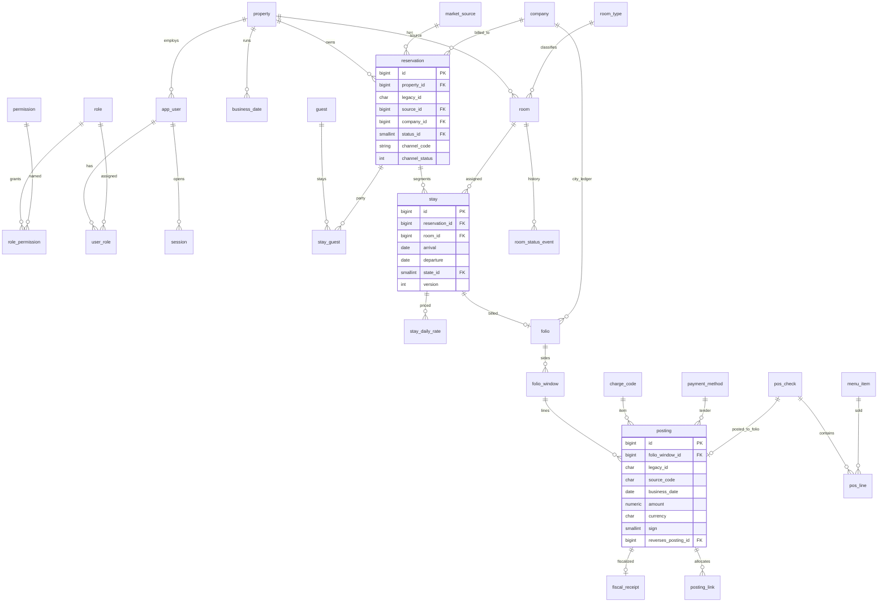

# 2. База данных

Источник схемы — дамп HeidiSQL `DB/db.sql` (MariaDB 10.11.15, база в дампе называется `hotelnext`; PHP подключается к имени `resort` — на бою имя базы задаётся профилем, это не вторая модель). Других миграций (Flyway, Liquibase, набор ALTER) в репозитории нет. Схема живёт как полный дамп и как неявный контракт SQL в C++.

Цифры дампа:

| Показатель | Значение |
|------------|----------|
| `CREATE TABLE` | 187 операторов, 186 реальных таблиц + заглушка `guests` |
| `PRIMARY KEY` | 178 |
| `FOREIGN KEY` / `REFERENCES` | 0 |
| `UNIQUE` | 2 (`f_cardex.f_cardex`, `f_nationality` по alpha2) |
| Вторичные индексы | порядка 45 |
| Процедуры | 21 |
| Триггеры, функции, view | нет |
| Кодировка | в основном `utf8mb3`, исключения `utf8mb4` и `latin1` (`f_eod`) |

`AUTO_INCREMENT` говорит, что база побывала в работе: гости — 63222, связка бронь–гость — 347254, city ledger — 90191, права — 30425, сессии — 10943, конец дня — 1886. В этом конкретном дампе строк меньше (гости ~159, брони ~258, `users` — 3): это срез, не пустая учебная схема. Относиться к файлу как к данным отеля.

## 2.1. Сводка текущей схемы

Ниже — операционное ядро. Полный перечень имён таблиц — в конце раздела.

### Бронь — `f_reservation` (god-таблица, ~60 колонок)

PK `f_id char(16)`.

- Жизненный цикл: `f_state` (заезд/бронь/выезд/отмена/OOO/…) и отдельно `f_reserveState` (confirmed/guaranteed/tentative/…). Оба — `smallint` без FK на справочники.
- Номер и люди: `f_room`, `f_guest`, `f_man/f_woman/f_child/f_baby`, `f_group`.
- Коммерция, скопированная в заголовок: `f_roomFee`, `f_mealPrice`, `f_pricePerNight`, `f_vat`, `f_vatAmount`, `f_vatMode`, `f_total`, `f_grandTotal`, `f_totalUSD`, early/late fee, extra bed, commission.
- Фолио: `f_invoice char(16)` — не FK на `f_invoice.f_id int`.
- Источник: `f_cardex varchar(32)` (код, не id), `f_cityLedger int`.
- Канал: `f_booking`, `f_chm`, `f_chmstatus`.
- Аудит: автор, последний редактор, cancel, `f_version`.
- Мусорные поля: `f int default 0`, `f_oldid char(8)`, `f_base`.

Рядом, уже ближе к норме:

- `f_reservation_guests` — M:N бронь/гость, флаг `f_first`;
- `f_reservation_prices` — цена на дату (в дампе всего ~53 строки: ночные цены есть не у всех броней);
- `f_reservation_meal`, `f_reservation_remarks`, `f_reservation_group`, `f_reservation_guests_history`.

Справочники: `f_reservation_state` (0 None, 1 Check In, 2 Reserved, 3 Chekout, 4 Out of order, 5 Dirty, 6 Canceled, 7 Service, 8 Service removed, 9 Out of inventory), `f_reservation_status` (1 Confirmed … 5 Block).

### Номерной фонд

- `f_room` — класс, вид, этаж, short, тариф, кровать, `f_state`, корпус, телефон, DND (`f_donotdisturbe`).
- `f_room_classes`, `f_room_view`, `f_room_bed`, `f_room_building`, `f_room_arrangement`, `f_room_rate` (сезон окном месяц/день, не интервалом дат).
- `f_room_state` — 0 Vacant ready, 1 Occupied, 2 Vacant not ready, 3 OOO, 4 House use, 5 Complimentary, 6 Out of inventory.
- Журнал: `f_room_state_change`. Инвентарь номера: `f_room_inventory*`.

Статус номера и «состояние брони» делят похожие коды и разные смыслы (см. документ 1). Housekeeping — это смена `f_room.f_state`, а не задача горничной.

### Гость и компании

- `f_guests` — ФИО, пол и обращение строками (`varchar`, не FK), дата рождения, гражданство `f_nation`, паспорт одной строкой, телефоны, email, адрес.
- `f_city_ledger` — компания для дебиторки (имя, адрес, телефон, email, `f_extra1/2`).
- `f_cardex` — источник/рынок брони: код, комиссия, VAT, даты действия, контакты, `f_cityLedger varchar(16)`.

Паспорт, адрес и контакты не разделены. История документа гостя не хранится. Один и тот же человек при повторном визите — вопрос дисциплины оператора, уникального ключа по документу нет.

### Деньги — `m_register`

PK `f_id char(16)`. Тип проводки `f_source char(2)` → справочник `m_vaucher` (сам справочник узкий: код и подпись).

Колонки факта: рабочая дата `f_wdate`, календарная `f_rdate`, пользователь, номер **строкой** `f_room varchar(16)`, имя гостя строкой `f_guest varchar(512)`, `f_finalName`, код услуги `f_itemCode`, суммы AMD/VAT/USD, режим НДС, фискальные номер/дата/время/аппарат, способ оплаты, карта, city ledger, комментарий оплаты, знак `f_sign`, ссылки `f_doc` / `f_rec` / `f_inv` (char 16), отмена, сторона фолио `f_side`, сессия, `f_base`, безымянное `p`.

Это и журнал, и фолио, и касса, и фискальный реестр, и дебиторка.

Коды ваучеров из дампа (дубли `RR` и `CM` уже в данных):

| Код | Смысл |
|-----|--------|
| AV | аванс |
| RC | смена тарифа |
| PS | ресторан |
| TR | трансфер |
| CM | звонок |
| CO | выезд |
| RM | rooming / начисление проживания |
| RV | приходный |
| CH | постчардж |
| DS | скидка |
| RR | восстановление |
| RS | бронь |
| PE | мероприятие |
| RF | возврат |
| IN | счёт |
| DR | строка блюда |
| CR | начальный остаток CL |
| TC | перенос на city ledger |
| CI | заезд |
| AT | перенос аванса |
| MR | переезд в другой номер |

Параллельно существуют узкие таблицы `m_v_advance`, `m_v_call`, `m_v_checkout`, `m_v_discount`, `m_v_invoice`, `m_v_postcharge`, `m_v_receipt`, `m_v_refund`, `m_v_transfer_amount`. Часть деталей проводки размазана между ними и `m_register`.

`f_invoice` / `f_invoice_content` в дампе пустые (0 строк). Живой каталог услуг — `f_invoice_item` (+ группа, налоговая карта `f_invoice_item_tax`). Пустую `f_invoice` нельзя удалять вслепую на бою: сначала счётчик `insert into f_invoice` по коду. В этом репозитории запись идёт в `m_register`.

Способы оплаты `f_payment_type`: наличные, карта, дебет, city ledger, бартер, breakfast, PayX, терминал, CPAY, Idram. Справочник уже про конкретный объект в Армении, не про абстрактный tender type.

### Ресторан и склад

- Меню: `r_dish` (имена en/ru/am, цвета, картинка `mediumblob` в строке блюда, налог, единица), разделы, модификаторы, рецептуры `r_recipe`, залы `r_hall`, столы `r_table`, принтеры, склады `r_store`.
- Заказ: `o_header` (char 16, зал, стол, официант, оплата, city ledger **строкой**, бронь, итог), строки `o_dish`.
- Состояния заказа: 1 OPENED, 2 CLOSED, 3 CANCELED, 4 TRANSFERED, 5 EMPTY.
- Складские документы: `r_docs` / `r_body`, плюс второй контур `st_header` / `st_body` / `st_store`.
- Касса предприятия: `c_cash`, `c_doc_type`.
- Долги точки: `o_debt_holder`, `o_debts`, `o_debt_pay`.

Два складских контура (`r_*` и `st_*`) — повод для сверки «какой пишет бой», а не для немедленного DROP.

### Доступ

- `users`: логин, MD5 в `varchar(32)`, PIN-пароль `f_altPassword` тоже MD5, группа, состояние.
- `users_groups`, `users_states` (1 активен, 2 уволен), `users_rights` (группа × числовой `f_right` × флаг). Уникального ключа `(f_group, f_right)` нет, строк в истории id — десятки тысяч.
- `s_user` / `s_user_group` — второй, спящий справочник (пароль `tinytext`).
- `s_user_session`, `web_sessions` — разные сессии десктопа и PHP. У обеих `f_start` объявлен как `ON UPDATE current_timestamp()`, то есть любое обновление строки портит время входа. `f_end` по умолчанию `'0000-00-00'` — нулевая дата, не NULL.

### Служебное

- `f_eod` — отметка конца дня (только datetime, charset latin1).
- `s_days` — открытые рабочие дни.
- `f_global_settings` — EAV (`f_key`, `f_value mediumtext`).
- `serv_reports` — имя, меню, **`f_sql text`**, ширины, заголовки, итоги.
- `serv_id` / `serv_id_counter` — генератор номеров.
- `airwicktravelline` — четыре текстовых поля (connection, availability, room types, rate plans) под старый канал. Exely в эту таблицу не укладывается, он пишет бронь напрямую.
- `salary` — дата, сотрудник, сумма, без справочника сотрудников в явном виде.

## 2.2. Нарушения нормализации и целостности

| # | Проблема | Почему это бьёт по отелю | Где видно |
|---|----------|--------------------------|-----------|
| 1 | Нет FK | Нельзя доказать, что проводка ссылается на существующую бронь и гостя | весь `db.sql` |
| 2 | God-таблица брони | Цена, НДС, состав гостей, канал и статус в одной строке; правка одной цифры не обновляет ночной календарь | `f_reservation` |
| 3 | God-таблица регистра | Нельзя ввести ограничение «у аванса есть способ оплаты, у rooming его нет» | `m_register` |
| 4 | Имена и номера строками в проводке | Переименование гостя не меняет историю, отчёт по имени врёт | `m_register.f_guest`, `f_finalName`, `f_room` |
| 5 | Деньги и на брони, и в `f_reservation_prices`, и в регистре | Три источника тарифа | колонки `f_pricePerNight` / `f_total*` |
| 6 | Разные типы одного id | Фолио char(16) против `f_invoice int`; city ledger то int, то varchar | бронь, cardex, `o_header.f_cityLedger` |
| 7 | Справочники не обязательны | `f_state = 42` или `-4` запишется | `defines.h` против `f_reservation_state` |
| 8 | Нет уникальности логина | Два `users` с одним `f_username` | нет UNIQUE |
| 9 | Дубли кодов ваучеров | `RR`, `CM` дважды | `INSERT INTO m_vaucher` |
| 10 | EAV вместо колонок | Рабочий день, id начисления, фискальный пароль и текст слогана в одном мешке | `f_global_settings`, `s_settigns_values` |
| 11 | JSON/XML в text | Канал и фискальный черновик нельзя проиндексировать и связать | `airwicktravelline`, `m_temp_advance.f_json` |
| 12 | Картинка блюда в OLTP-строке | `mediumblob` в `r_dish` раздувает чтение меню | `r_dish.f_image` |
| 13 | Отчёт = исполняемый SQL | Нет границы прав | `serv_reports.f_sql` |
| 14 | Временные таблицы как постоянные | `m_temp_advance`, `o_temp_disc`, `f_reservation_last` | префиксы temp |
| 15 | Два складских и два пользовательских контура | Неясно, какой источник истины | `r_*` vs `st_*`, `users` vs `s_user` |
| 16 | Нулевые даты и ON UPDATE на `f_start` | Сессия «вечно открыта» или время входа прыгает | `s_user_session`, `web_sessions` |
| 17 | Строковые пол, титул, гражданство у гостя | `f_sex varchar(8)` при живой таблице полов в кэше | `f_guests` |
| 18 | Сезон тарифа как месяц/день без года | Граница Нового года и исключения на даты не выражаются | `f_room_rate` |
| 19 | Нет запрета пересечения броней по номеру | Две брони на один номер в одни даты. Ловит только UI | нет exclusion-constraint |
| 20 | Колонки `f`, `p`, `f_oldid` | Невозможно сопровождать | `f_reservation`, `m_register`, `o_header` |
| 21 | `utf8mb3` | Эмодзи в замечании гостя и часть символов режутся; сравнение с `utf8mb4` на новой таблице будет болеть | DEFAULT CHARSET таблиц |
| 22 | Пароль ККМ и пароль пользователя в тех же таблицах, что операционные данные | Бэкап базы = утечка секретов | `users`, `serv_tax`, `s_tax_map` |

Нормальная форма, к которой стоит идти, — практически 3NF по операционным сущностям плюс явные журналы (статус номера, проводка, аудит), а не «одна широкая строка на бронь». Денормализованные имена на печатной форме счёта допустимы как снимок на момент печати (`posting.guest_name_snapshot`), но не как единственная ссылка.

## 2.3. Целевая схема

Принципы:

- Один арендатор в строке: `property_id`. Пока бой — «база на отель», колонка заполняется одной константой, зато веб и вторая гостиница не требуют второй ломки.
- Суррогатный `bigint` внутри, старый `char(16)` сохраняется как `legacy_id` до конца миграции.
- Деньги — `decimal(14,2)`, валюта отдельной колонкой, не пара `amountAmd` / `amountUsd` навсегда. Курс — на проводке.
- Статус — FK на справочник, запрещённые переходы проверяет сервис, не только UI.
- Проводка неизменяема: отмена — новая строка со знаком, не `UPDATE` суммы.
- Сырой SQL отчёта в таблице, которую читает клиент, исчезает. Определение отчёта хранит код отчёта и параметры.

### ERD ядра

### Список целевых таблиц

Имена новые, в `snake_case`, без префикса `f_`. На время миграции старые имена остаются view.

**Тенант и доступ**

| Таблица | Назначение | Откуда |
|---------|------------|--------|
| `property` | Отель: код, часовой пояс, валюта учёта, название | новый; сейчас «вся база» |
| `app_user` | Человек, пароль Argon2id, состояние | `users` |
| `role`, `permission`, `role_permission`, `user_role` | RBAC с именем права, не только числом | `users_groups`, `users_rights` |
| `session` | Сессия десктопа и веба, отзыв на конце дня | `s_user_session`, `web_sessions` |
| `user_setting` | Личные настройки ключ/значение с типом | `f_users_settings` |

**Гости и компании**

| Таблица | Назначение | Откуда |
|---------|------------|--------|
| `guest` | Идентичность: ФИО, дата рождения, гражданство FK, контакты | `f_guests` |
| `guest_document` | Паспорт/ID, срок, страна выдачи; несколько документов | `f_guests.f_passport` |
| `company` | City ledger | `f_city_ledger` |
| `market_source` | Cardex / канал продаж, комиссия, VAT | `f_cardex`, `f_cardex_group` |
| `nationality`, `guest_title`, `sex` | Справочники | уже есть частично |

**Номерной фонд и housekeeping**

| Таблица | Назначение | Откуда |
|---------|------------|--------|
| `building`, `room_type`, `room_view`, `bed_type` | Справочники | `f_room_building`, `f_room_classes`, … |
| `room` | Номер, тип, этаж, телефон; текущий статус — FK | `f_room` |
| `room_feature` | Связь номера и extra | `f_room_extra*` |
| `room_status_event` | Кто и когда сменил статус, из какого в какой | `f_room_state_change` |
| `hk_task` | Задача горничной на дату и номер | новый, сейчас задачи нет |
| `room_block` | OOO / out of inventory интервалом дат | сейчас это псевдо-бронь со статусом 4/9 |

**Бронь**

| Таблица | Назначение | Откуда |
|---------|------------|--------|
| `reservation` | Заголовок: источник, компания, канал, группа, комментарий | шапка `f_reservation` |
| `reservation_group` | Группа | `f_reservation_group` |
| `stay` | Один отрезок: номер, заезд, выезд, состояние, состав pax, version | тело `f_reservation` |
| `stay_guest` | Гости на отрезке, признак основного | `f_reservation_guests` |
| `stay_daily_rate` | Цена и код услуги на каждую ночь | `f_reservation_prices` + поля fee |
| `reservation_note` | Замечания с автором и временем | `f_reservation_remarks`, `f_remarks` |
| `reservation_status`, `stay_state` | Справочники без опечаток, включая отрицательные служебные коды как отдельные строки, не как «минус id» | `f_reservation_status`, `f_reservation_state`, `defines.h` |

Групповая бронь на несколько номеров — несколько `stay` с общим `reservation_id`, а не копипаста заголовка.

**Тарифы**

| Таблица | Назначение | Откуда |
|---------|------------|--------|
| `rate_plan` | Тарифный план | размазано по cardex и `f_room_rate` |
| `rate_amount` | Цена типа номера на интервал дат | `f_room_rate` (месяц/день → `date_from`/`date_to`) |

**Фолио и касса**

| Таблица | Назначение | Откуда |
|---------|------------|--------|
| `charge_code` | Услуга, группа, НДС, фискальный отдел | `f_invoice_item*` |
| `payment_method` | Tender: cash, card, city ledger, idram, … | `f_payment_type` |
| `folio` | Счёт пребывания или компании | смысл `f_reservation.f_invoice` |
| `folio_window` | Сторона счёта (гость / компания) | `m_register.f_side` |
| `posting` | Неизменяемая проводка | `m_register` |
| `posting_link` | Применение аванса, трансфер, связь ресторана и фолио | `f_doc` / `f_rec` / `f_inv`, `f_used_advance` |
| `fiscal_receipt` | Чек ККМ: аппарат, номер, время, статус | поля `f_fiscal*` |
| `cash_session` | Смена кассира | сейчас размазано по сессии пользователя |
| `business_date` | Открытый рабочий день, кто закрыл | `f_eod`, `s_days`, ключ `Working date` в настройках |

Тип проводки остаётся коротким кодом (`RM`, `AV`, …) — его уже знает персонал и печатные формы. Меняется носитель: справочник с уникальным `code` и признаками `affects_balance`, `requires_payment_method`, `fiscal_kind`.

**Ресторан**

| Таблица | Назначение | Откуда |
|---------|------------|--------|
| `outlet`, `dining_table` | Зал и стол | `r_hall`, `r_table` |
| `menu_item`, `menu_group`, `modifier` | Меню; картинка — файл или отдельная таблица, не blob в горячей строке | `r_dish*` |
| `pos_check`, `pos_line`, `pos_payment` | Заказ | `o_header`, `o_dish`, `o_header_payment` |
| `recipe`, `stock_item`, `stock_location`, `stock_document`, `stock_line` | Склад, один контур | `r_recipe`, `r_store`, `r_docs`, после сверки со `st_*` |

**Прочее**

| Таблица | Назначение | Откуда |
|---------|------------|--------|
| `phone_call` | CDR | `f_call_log`, `f_call_rate` |
| `coupon*` | Купоны, если продукт ещё продаётся | `d_coupon*` |
| `audit_event` | Кто, когда, сущность, действие, diff JSON | `f_changes_tracking`, `airlog` |
| `setting` | Типизированные настройки объекта, не произвольный SQL | `f_global_settings` |
| `report_definition` | Код отчёта, параметры, права; SQL только на сервере | `serv_reports` без клиентского `f_sql` |
| `channel_booking_map` | Внешний id брони Exely → `reservation_id` | `f_chm`, `f_booking` |
| `id_sequence` | Счётчик человекочитаемых номеров по префиксу и отелю | `serv_id_counter` |

Таблицы, которые в целевую модель не переносятся как есть: `m_temp_advance`, `o_temp_disc`, `id_back`, `h_tables`, `airwicktravelline`, `s_user`, пустая заглушка `guests`, дубли `m_v_*` (их поля становятся колонками `posting` или отдельной 1:1, если у типа правда есть уникальные атрибуты).

`salary` и учёт машин (`d_car_*`, `o_car`) — решить отдельно: если модуль живой на объекте, переносится как `payroll_line` / `vehicle`; если нет — архив и выключение экрана. В этом аудите по коду экраны есть, значит удалять таблицы рано.

## 2.4. Стратегия миграции данных без остановки

Большой переезд «выключили отель, перелили, включили новый клиент» не подходит: ночная смена, фискальный чек и шахматка должны жить непрерывно. Движок на этом этапе не менять: остаёмся на MariaDB 10.11. Смена СУБД вместе со схемой и API — три проекта сразу.

Подход — expand/contract по агрегатам, писатель каждый раз один.

### Почему не dual-write из старого десктопа

Пока станция пишет произвольный SQL, триггер «после INSERT в `m_register` вставь в `posting`» хрупок: часть экранов делает многошаговый `UPDATE`, часть пишет во вспомогательные `m_v_*`, часть откатывает транзакцию криво. Триггер на боевой кассе — лишний риск.

Порядок другой:

1. Модуль начинает писать **только через API**.
2. API пишет в новые таблицы.
3. Для ещё не переведённых экранов и процедур API (или короткий период) поддерживает **совместимое представление**: view с прежним именем или синхронную проекцию в старую таблицу тем же транзакционным кодом сервиса.
4. Когда читателей старой формы не осталось — view снимается.

Так dual-write находится в одном процессе, в одной транзакции, с логом расхождений, а не в каждом `winvoice.cpp`.

### Шаги на один агрегат (пример — бронь)

1. **Снять инварианты с боя**, не с дампа: число броней по `f_state`, пересечения по номеру и датам, висячие `f_guest`, расхождение `f_grandTotal` и суммы `f_reservation_prices`. Скрипт только читает. Результат — список грязи, которую надо вычистить до включения FK.
2. **Expand.** Новые таблицы рядом со старыми. Старый клиент их не видит. Добавление пустых таблиц онлайн.
3. **Backfill пакетами** (по `f_id`, ночами, ограничение размера транзакции). Идемпотентность: `INSERT … ON DUPLICATE KEY UPDATE` по `legacy_id`. На время backfill триггер не ставим.
4. **Сверка.** Счётчики, сумма ночных цен, список id, которые не легли. Пока сверка не сошлась, переключение запрещено.
5. **Переключить писателя.** Десктопная шахматка ходит в API. API в одной транзакции пишет `reservation`/`stay`/`stay_daily_rate` и, пока живы старые отчёты, обновляет строку `f_reservation` как проекцию (compat-write). Либо публикует view `f_reservation` вместо таблицы — но view с `INSTEAD OF` в MariaDB ограничен, поэтому на практике проще **compat-write из сервиса**, а таблицу оставить физической, пока процедуры делают `SELECT` из неё.
6. **Запретить прямой UPDATE** старой таблицы учётной записью десктопа: `REVOKE INSERT, UPDATE, DELETE ON f_reservation FROM hotel_client`. К этому моменту у десктопа уже не должно быть этой учётки на запись. Это и есть настоящий рубеж.
7. **Contract.** Когда отчёты и канал читают новые таблицы, compat-write выключается, старая таблица переименовывается в `f_reservation_retired` (не DROP в тот же день), через оговорённый срок хранения удаляется.

Фолио мигрируется позже брони и только после того, как конец дня тоже в API. Иначе ночной прогон и новый сервис будут писать в два регистра.

### Совместимость отчётов

21 процедура и `serv_reports` продолжают читать старые имена, пока их SQL не переписан. Поэтому старые таблицы живут до конца фазы отчётов. Менять процедуру и форму регистра в один день не нужно.

Для чтения из новых таблиц наружу отдаются **compat-view** только там, где старая форма — плоская проекция (справочник гостей, номер). Для `m_register` view будет широкой и уродливой, это нормально: она мост, не целевой контракт.

### Простой

| Операция | Простой |
|----------|---------|
| Новые таблицы, backfill, сверка | нет |
| Переключение модуля на API | нет, если флаг на клиента и откат на старый путь |
| `REVOKE` прямой записи | короткий, в окно после обновления всех станций |
| Включение FK | только после отчёта «сирот нет»; на больших таблицах — `ALTER` онлайн (MariaDB 10.11), не в час заезда |
| Удаление старой таблицы | нет, это уже архив |

Откат модуля: флаг клиента обратно на локальный SQL, compat-write останавливается, новые строки, появившиеся только в новой схеме, догоняются обратной проекцией. Поэтому до конца фазы фолио обратная проекция обязана быть написана и проверена на копии базы. Без репетиции на копии в бой не выходить.

### Данные, которые нельзя тащить как есть

- MD5-пароли не «перехешировать» задним числом: при первом входе через API проверить MD5 и сразу записать Argon2id, старый хеш стереть. Это известный приём upgrade-on-login.
- Пароли ККМ вынести из операционных таблиц в секрет сервиса (файл прав ОС или менеджер секретов), в базе оставить id аппарата.
- Дамп с гостями и хешами убрать из git до того, как репозиторий увидит лишний человек. Схема для разработки — отдельный DDL без `INSERT` гостей и пользователей.

### Чего не делать

- Не включать FK на живые таблицы в первый же день: сироты поломают заезд.
- Не переименовывать `m_vaucher` → `voucher` отдельным косметическим ALTER, пока имя зашито в сотнях запросов. Новое имя появится в новой таблице, старое доживёт во view.
- Не нормализовать ресторан и фолио параллельно двумя людьми без общего `posting`: счёт за ужин и есть проводка.
