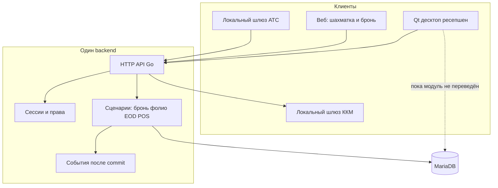

# 3. Целевая архитектура

## 3.1. Решение

Оставить десктоп Qt. Забрать у него базу.

Рядом с MariaDB поднимается один HTTP-сервис. Он единственный процесс, которому разрешены `INSERT`/`UPDATE`/`DELETE`. Десктоп, будущий браузер, ATS и канал Exely ходят в него. Прямой `QMYSQL` из виджета выключается модуль за модулем.

Полный rewrite «с нуля на новом языке и сразу новый UI» не берём. Операционные правила сейчас не описаны нигде, кроме `wreservationroomtab.cpp`, `winvoice.cpp`, `dlgendofday.cpp` и соседних файлов. Пока эти сценарии не зафиксированы тестами на копии базы, переписывать их вслепую значит сломать ночь отеля. Strangler fig как раз про это: поверхность продукта та же, дверь в данные новая.

Движок БД на время переноса — MariaDB 10.11. Целевые таблицы из документа 2 спокойно живут в MariaDB. Переход на PostgreSQL имеет смысл только если позже понадобятся row-level security и exclusion constraint на пересечение броней в самой СУБД. Это отдельное решение после того, как писатель уже один. Сейчас смена движка ничего не упростит.

## 3.2. Почему backend на Go, а не «ещё один Qt-процесс»

Рассматривались три опоры.

**Вынести правила в C++ библиотеку и отдать их через Qt Http Server.** Язык команде родной, куски `DoubleDatabase` можно тащить. На практике правила не лежат в библиотеке: они сидят внутри `QWidget`, `QMessageBox` и `exit(0)`. Вырезать их в чистые функции стоит столько же, сколько заново описать сценарий. Qt-сервер останется с теми же глобальными `__dd1Password`, unity-build и путями `C:/Development`. Для продукта, которым должны пользоваться браузер и несколько отелей, это слабый каркас: OpenAPI, миграции, обычные веб-фреймворки найма, нормальный деплой одним бинарником без GUI-стека.

**Переписать всё на PHP, раз уже есть `smarthotel/`.** Каталог — форма логина на 9 файлов с паролем `root` в репозитории и несовпадением имён колонок. Опираться на него не на что.

**Новый сервис на Go.** Это основной выбор.

- Один статический бинарник рядом с MariaDB, без Qt и без Windows-only линковки.
- Явный SQL (sqlc или аккуратный слой запросов) близок к тому, как устроен сегодняшний код: команда думает таблицами, а не скрытым ORM. ORM с магией здесь вреден — слишком легко размазать проводку.
- HTTP, JSON, OpenAPI, middleware, тесты в стандартной библиотеке — обычная работа, не исследовательская.
- Веб-клиент и десктоп получают один контракт.
- Модуль Exely уже показывает нужную форму: DTO канала отдельно, черновик брони отдельно, запись отдельно. Её переносят в сервис как первый внешний адаптер, не как образец SQL в кнопке.

C++ остаётся там, где он уже окупается: десктоп (шахматка, печать, офлайн-устойчивый UI ресепшен) и локальный шлюз устройств (ККМ, COM-порт АТС). Шлюз — маленькая программа на станции, которая принимает от API команду «напечатай чек» и говорит с железом. `printtaxno.cpp` не обязан переезжать в облако: фискальный регистратор стоит на ресепшене.

Если у команды появится сильный .NET и не будет желания брать Go, ASP.NET Core закрывает ту же нишу (HTTP, OpenAPI, один сервис, Windows-навык). Менять рекомендацию можно до конца фазы 2. Менять её после появления контракта API дорого. Нельзя оставлять «пока поживём на Qt-сервере», потому что туда уедут те же виджетные зависимости.

## 3.3. Форма API

Публичный контракт — **REST, JSON, префикс `/api/v1`**, описание OpenAPI 3. Контракт генерирует клиент для Qt и типы для веба. Ручной разбор JSON в каждом диалоге — путь обратно к `DoubleDatabase`.

Почему не gRPC как главный протокол: браузеру нужен обход через grpc-web, отчёты и файлы (xlsx, pdf) проще в HTTP, отладка смены на ресепшене чаще всего `curl`. gRPC можно добавить позже для шлюза ККМ, если задержка и стриминг реально упрут. Сейчас не упирают.

Почему не GraphQL: фолио и конец дня — командные операции с инвариантами, а не произвольный граф, который клиент собирает сам. Произвольные запросы клиента — как раз сегодняшняя беда `serv_reports.f_sql`.

Ресурсы первого контура (не полный список на годы):

| Метод и путь | Смысл |
|--------------|--------|
| `POST /api/v1/sessions` | Логин, выдача сессии |
| `GET /api/v1/properties/{property}/rooms/rack?from&to` | Шахматка |
| `GET/POST /api/v1/properties/{property}/reservations` | Список и создание |
| `PATCH /api/v1/properties/{property}/stays/{id}` | Даты, номер, статус, version |
| `POST /api/v1/properties/{property}/stays/{id}/check-in` | Команда, не «поменяй поле» |
| `POST …/check-out`, `…/cancel`, `…/move-room` | То же |
| `GET/POST …/folios/{id}/postings` | Проводки |
| `POST …/business-date/close` | Конец дня |
| `GET …/reports/{code}` | Отчёт по коду, параметры в query, SQL внутри сервиса |
| `POST …/channel/exely/pull` | То, что сейчас делает кнопка на шахматке |

Команды, которые меняют деньги или статус, — отдельные POST, идемпотентные через заголовок `Idempotency-Key`. Повторный клик на ресепшене не должен создавать второй аванс.

Ошибки — проблема домена, не HTTP-текст исключения MariaDB: `409` если `version` устарел, `422` если номер занят, `409` если рабочий день уже закрыт.

Пагинация списков, фильтр по дате, код объекта в пути. Поле `property` в пути нужно даже пока объект один: клиенты не зашивают «база и есть отель».

## 3.4. Аутентификация и права

Сейчас пароль сверяется как `md5` в SQL, а право — число `f_right` в `users_rights`, которое клиент сам читает из базы. Клиент, который сам читает права из базы, может их не читать.

Целевая схема:

- Пароль — Argon2id. Старый MD5 принимается один раз при входе и тут же заменяется (документ 2).
- Сессия серверная: случайный токен в `session`, в клиенте — httpOnly-cookie для браузера и тот же токен в безопасном хранилище десктопа. Отзыв сессии на конце дня уже есть как намерение (`dlgendofday` закрывает сессии) — оно начинает работать по-настоящему.
- JWT имеет смысл как короткоживущий access только если появятся несколько сервисов. На одном сервисе непрозрачная сессия проще отзывается. Не плодить оба механизма в фазе 2.
- Каждый запрос несёт пользователя, набор прав и `property_id`. Проверка права на сервере, рядом с командой: «check-in» не выполнится, даже если кнопку нарисовали.
- Числовые `cr__*` / `f_right` сохраняются как код права в таблице `permission`, чтобы не переучивать матрицу в день переключения. Имена появляются рядом с числами.
- Учётка MariaDB для сервиса — одна, без прав `FILE`, `SUPER` и без доступа к чужим базам. Учётка десктопа после миграции модуля либо исчезает, либо остаётся `SELECT` на compat-view до конца фазы отчётов. Учётки `root` с рабочих станций быть не должно.
- UDP-ответ с паролем базы выключается. Обнаружение сервера, если оно ещё нужно, отдаёт только URL API.

Повышение прав («raise user», `dlgraiseuser.cpp`) — отдельная серверная операция со своим аудитом, не второй SQL с MD5 в диалоге.

## 3.5. Несколько объектов

Сейчас мультиотельность сделана честно и бедно: другая база в комбобоксе логина.

Две ступени, чтобы не смешивать данные двух юрлиц раньше времени:

1. **База на объект, маршрутизация в сервисе.** Конфиг сервиса: код отеля → DSN. Токен пользователя привязан к списку кодов. Это повторяет сегодняшнюю эксплуатацию и уже позволяет одному веб-приложению открывать разные объекты. Общие справочники (сеть) на этой ступени не делаются.
2. **Общая схема и `property_id`**, когда фолио и конец дня уже в API и отчёт сирот чистый. Перенос строк из базы объекта в общую схему — ещё один backfill, уже без участия десктопного SQL.

До ступени 2 не тащить данные двух отелей в один `m_register`. Фискальный контур и рабочая дата у объектов разные.

Пользователь сети на ступени 1 — запись в каждом объекте либо центральная маленькая база `identity` (только пользователи и членство в отеле). Вторая лучше: не хочется заводить администратора руками в каждой MariaDB. Её можно ввести в фазе 2, она не зависит от нормализации фолио.

## 3.6. Клиенты

Пунктир — временный. Критерий конца программы: пунктира нет, `REVOKE` на запись с учётных записей станций выполнен.

Десктоп остаётся толстым в хорошем смысле: шахматка рисуется локально, формы не становятся HTML. Он становится тонким в плохом смысле сегодняшнего слова «тонкий»: не решает, можно ли заехать, и не считает проводку. Кэш справочников можно оставить, но источник обновления — событие API, не свой `INSERT` плюс `hotel_cache_update`.

Веб на том же OpenAPI. Первый экран, который имеет смысл, — шахматка только на чтение и карточка брони. Кассу и конец дня в браузер не класть, пока те же команды не отработают на десктопе через API хотя бы одну смену. Иначе появятся два писателя.

Стек веба в этом плане не фиксируется (React или Vue). Фиксируется запрет: веб не получает строку подключения к MariaDB. `smarthotel/` не развивать.

ATS читает COM-порт локально и шлёт `POST /phone-calls`. ККМ: API создаёт `fiscal_receipt` в состоянии `pending`, шлюз на станции забирает задание, печатает, возвращает номер чека. Сегодняшняя связка «диалог сам знает IP ККМ» (`serv_tax` в базе, пароль в таблице) заменяется заданием.

Exely: опрос undelivered и `HotelAvailNotif` выполняет сервис по расписанию, а не кнопка, которую забыли нажать. Кнопка на шахматке остаётся как ручной запуск той же команды. Лимиты протокола (30 ReadRQ в час, подтверждение около 20 минут) живут в сервисе один раз.

## 3.7. Realtime

Нужны события, а не номера кэшей.

После успешного commit сервис публикует в WebSocket канала объекта:

| Событие | Кому |
|---------|------|
| `stay.updated` | шахматка, карточка брони |
| `room.status_changed` | шахматка, housekeeping |
| `folio.posted` | открытый счёт |
| `business_date.closed` | все станции, принудительный рефреш рабочей даты |
| `pos.check_updated` | экраны ресторана |

Полезная нагрузка маленькая: id, version, тип. Клиент перечитывает ресурс по HTTP. Так не разъезжаются «сокет принёс половину строки» и база.

Текущий внешний сервис `register_socket` / `hotel_cache_update` выключается вместе с последним модулем, который ещё шлёт кэш-id. До этого момента новый сервис может дополнительно слать старый JSON, чтобы непереведённые станции не слепли. Это временный адаптер, его срок — до конца фазы, где шахматка уже на API.

Конфликт редактирования брони (`f_version`, «вас опередили») переносится как есть: `PATCH` с `If-Match` / полем `version`, ответ `409`. Случайный `WORKING_SESSION_ID` больше не источник истины.

## 3.8. Сквозные технические правила сервиса

- Транзакция сценария на сервере. Конец дня — одна описанная последовательность с журналом шага, чтобы повтор после обрыва не начислил rooming дважды. Идемпотентность обязательна.
- Время: хранить UTC, рабочая дата — отдельное поле отеля. Проверку «станция разъехалась с сервером больше чем на 5 минут» перенести на сервер.
- Идентификаторы документов для человека (`AV-000123`) выдаёт сервис из `id_sequence` в той же транзакции, что и проводка. `exit(0)` на клиенте исчезает.
- Журнал аудита пишет сервис, одна база. Отдельная `airlog` не нужна, когда запись централизована.
- Структурные логи, request id, без паролей и без тел фискальных паролей.
- Миграции схемы — версионируемые SQL-файлы в репозитории сервиса (goose или аналог). `DB/db.sql` перестаёт быть способом «накатить базу».
- Тесты на сценарий: заезд, двойной заезд в тот же номер, отмена проводки, повтор конца дня, идемпотентный повтор аванса. Это входной билет модуля, не факультатив.

## 3.9. Что сознательно не входит в цель

- Свой конструктор произвольного SQL для пользователя. Отчёты — код на сервере и параметры. Конструктор можно вернуть позже как набор разрешённых колонок, не как текст запроса.
- Микросервисы «бронь / касса / ресторан» отдельными процессами. Границы модулей в одном бинарнике. Резать сеть между кассой и бронью рано: у них общая транзакция переноса ужина на комнату.
- Отказ от десктопа. Ресепшен с шахматкой, печатью и ККМ ещё долго живёт в Qt. Веб добавляется, а не заменяет смену в первый год работ.
- Мобильное приложение отдельным протоколом. Телефон горничной — тот же REST и событие `room.status_changed`, когда до него дойдёт очередь. Отдельный стек не заводить.
