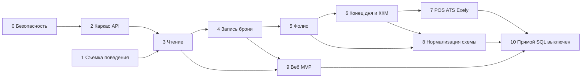

# 5. Дорожная карта

Порядок — strangler fig. Каждый шаг оставляет отель на текущем десктопе. Новый писатель появляется раньше новой схемы, схема — раньше удаления старых таблиц, веб — раньше выключения последнего прямого SQL.

Оценка объёма дана не календарём, а тем, сколько контуров придётся затронуть:

| Объём | Смысл |
|-------|--------|
| S | Один каталог или набор файлов, поведение смены не меняется |
| M | Один сценарий (например, чтение шахматки) end-to-end |
| L | Денежный или ночной контур, нужна репетиция на копии базы |
| XL | Смена источника истины для фолио и конца дня |

Зависимости между фазами жёсткие там, где указано «после». Фазы 0 и 1 можно вести параллельно.

## Фаза 0. Закрыть дыры, не трогая смену

**Цель.** Репозиторий и сеть перестают раздавать пароль базы и персональные данные.

**Задачи.**

- Сменить пароль MariaDB, который лежит в `smarthotel/conf.php`, и пароли из `dlgtracking.cpp` / `Tester`. Учётка приложения — не `root`.
- Выключить или закрыть файрволом UDP `"who"` в `Server/dlgmain.cpp`, пока ответ содержит пароль.
- Убрать из git дамп с данными, скрины `cards/`, `.idea`, зашитые пароли. В репозитории оставить DDL.
- Добавить в `.gitignore` дампы, `*.jpeg` этого рода, `.idea/`.
- Проверить, кто ещё снаружи слушает `web_sessions` и каталог `smarthotel/`. Если виртуальный хост живой — снять его.

**Зависимости.** Нет.

**Риски.** Смена пароля обрывает станции, пока им не раздали новый профиль `preferences.dat`. Делать в начале дня, не в заезд. Старый UDP-поиск перестанет поднимать новые установки — это приемлемо, если пароль больше не ездит по сети.

**Объём.** S по коду, организационно чувствительно из-за паролей на станциях.

**Готово, когда.** Поиск по репозиторию не находит паролей и `10.1.0.2` с кредами; с рабочей станции нельзя UDP-запросом получить пароль БД; в git нет INSERT гостей и хешей `users`.

## Фаза 1. Зафиксировать поведение, которое нельзя потерять

**Цель.** Появиться список сценариев с цифрами, чтобы новый сервис было с чем сравнивать. Код смены не переписывается.

**Задачи.**

- Выбрать копию боевой базы (не дамп из git).
- Протокол на 15–20 сценариев: создать бронь, пересечение номера, заезд, проводка RM, аванс, перенос на city ledger, отмена проводки, выезд с ненулевым балансом, конец дня дважды, чек ККМ в тестовом аппарате, заказ ресторана на комнату, импорт Exely с `f_chmstatus`.
- Для каждого — вход, таблицы до/после, ожидаемые суммы.
- Отдельно: отчёт «сироты и пересечения» (документ 2, шаг сверки) — только SELECT.
- Инвентаризация ключей `f_global_settings` и пунктов меню `serv_reports` (id, имя, кто реально открывает).
- Поднять сборку в CI хотя бы до «CMake конфигурируется без `C:/Development`». Пока достаточно убрать абсолютные пути в переменные; полный Linux-билд не обязателен в этой фазе.

**Зависимости.** Желательна фаза 0, чтобы копия базы не уехала в git.

**Риски.** Протокол снимут не с того объекта. Брать базу того отеля, который считается эталоном.

**Объём.** M.

**Готово, когда.** Есть письменный протокол и скрипт сверки, который на копии повторяется. Без этого фаза 5 не начинается.

## Фаза 2. Каркас сервиса и сессия

**Цель.** Процесс, у которого есть DSN, миграции, лог и логин. Десктоп ещё пишет в базу по-старому.

**Задачи.**

- Репозиторий сервиса (можно каталог `backend/` в этом же дереве, отдельный модуль, не внутри `Resort.pro`).
- Go, HTTP, `/api/v1`, OpenAPI, миграции SQL.
- Конфиг объектов: код → DSN. Секреты из окружения, не из исходника.
- `POST /sessions`, проверка MD5 и немедленная замена на Argon2id, таблица `session`.
- Права читаются сервисом из `users_rights` и кладутся в сессию. Пока хотя бы «пустой список прав = отказ на команды», даже если команд ещё нет.
- Здоровье: `GET /health` проверяет MariaDB.
- Десктоп не переключается.

**Зависимости.** Фаза 0.

**Риски.** Случайно выдать сервису `root`. Завести отдельного пользователя `hotel_api` с правами на одну базу.

**Объём.** M.

**Готово, когда.** С чистой машины сервис поднимается, логин тестового пользователя возвращает токен, неверный пароль не возвращает, в логе нет пароля, десктоп на объекте работает как раньше.

## Фаза 3. Чтение: шахматка, бронь, гости, номер

**Цель.** Доказать, что API и десктоп показывают одни и те же цифры. Запись ещё старая.

**Задачи.**

- `GET` rack, reservation, guest, room, справочники статусов.
- В десктопе один путь чтения шахматки за флагом. Флаг по умолчанию выключен.
- Сверка: за дату набор id броней и статусы номеров совпали с прямым SQL.
- WebSocket можно отложить. Чтение по кнопке «обновить» достаточно.

**Зависимости.** Фазы 1 и 2.

**Риски.** Расхождение из-за кэша `Cache/`. Сверять с базой, не с кэшем станции.

**Объём.** M.

**Готово, когда.** На копии и на одной пилотной станции шахматка в режиме API совпадает с режимом SQL за один и тот же день. Откат флага возвращает старый путь без переустановки базы.

## Фаза 4. Запись брони

**Цель.** Создание, правка, отмена, переезд номера, заезд и выезд как команды API. Проводки денег ещё пишет старый `winvoice` / конец дня — это осознанная граница. Заезд в этой фазе меняет статус и номер, но не изобретает новый способ начислять RM, если начисление сегодня делается отдельным экраном. Границу прописать в протоколе фазы 1, чтобы не утащить кассу раньше времени.

**Задачи.**

- Команды из документа 3 с `version` и `409`.
- Запрет пересечения по номеру на сервисе (проверка в транзакции, потом можно усилить ограничением СУБД).
- Идемпотентность создания.
- Десктоп: карточка брони и шахматка пишут через API по флагу.
- Compat: сервис обновляет `f_reservation` в той же транзакции, чтобы старые отчёты и конец дня видели бронь.
- Exely sink можно перевести здесь же, если запись брони уже одна: опрос остаётся ручным.

**Зависимости.** Фаза 3. Протокол пересечений из фазы 1.

**Риски.** Конец дня читает поля, которые API забыл спроецировать в `f_reservation`. Чеклист колонок, которые читает `dlgendofday.cpp`, обязателен до включения флага.

**Объём.** L.

**Готово, когда.** Пилотная станция сутки работает с флагом, старые станции видят её брони в шахматке, отчёты прибытий сходятся, откат флага не теряет строки.

## Фаза 5. Фолио и касса

**Цель.** Проводки создаёт только сервис. Это смена источника истины денег.

**Задачи.**

- Модель `posting` в коде сервиса. На диске на этой фазе допустимо писать всё ещё в `m_register`, но через один модуль `Ledger`, а не через 40 диалогов. Физическая нормализация — фаза 8. Так касса переезжает раньше ломки таблицы.
- Перенести по одному типу: аванс, rooming, скидка, постчардж, трансфер, city ledger, выезд. Каждый — сценарий из фазы 1.
- Отмена = обратная проводка.
- Десктопные диалоги становятся формами: собрали поля, вызвали команду, показали ошибку сервера.
- `exit(0)` генератора id больше не на клиенте: номер документа выдаёт `Ledger`.

**Зависимости.** Фаза 4. Не начинать параллельно с переписыванием конца дня.

**Риски.** Двойное начисление, если флаг включён не на всех станциях и старый диалог ещё пишет сам. Для денежных команд флаг общий на объект (сервис отвергает прямой путь учёткой станции), а не «галочка в одном exe». Практический приём: в день переключения типа ваучера `REVOKE` не нужен, если старый клиент ещё ходит в базу; поэтому **все станции обновляются до включения**, а сервис пишет, клиент только вызывает API. Смешанный режим «часть кассиров по-старому» для одного и того же кода ваучера запрещён.

**Объём.** XL.

**Готово, когда.** За рабочий день суммы по кодам ваучеров сходятся с эталонным днём на копии; повторный POST с тем же ключом не дублирует строку; необновлённая станция не может провести этот тип (кнопка честно говорит обновить программу).

## Фаза 6. Конец дня и фискализация

**Цель.** Ночной прогон и чек ККМ — команды сервиса. Железо остаётся локальным.

**Задачи.**

- `POST /business-date/close` по шагам с журналом: что уже начислено, чтобы повтор не создал второй RM.
- Закрытие сессий пользователей — реальное, через таблицу `session`.
- Шлюз ККМ на станции: забирает `fiscal_receipt` в `pending`, пишет номер чека. Пароль аппарата не в общей таблице операторов.
- Пилот на тестовом фискальном аппарате, потом на боевом в дневную смену, ночной прогон — после дневного успеха.

**Зависимости.** Фаза 5. Иначе конец дня и касса пишут в два места.

**Риски.** Самый дорогой сбой в PMS — двойной rooming ночью. Журнал шагов и прогон на копии за вчерашний день обязательны. Откат — восстановить базу из снимка, снятого перед первым боевым прогоном, и вернуть старый exe. Снимок перед первым боем — пункт чеклиста, не пожелание.

**Объём.** XL.

**Готово, когда.** Один боевой конец дня прошёл через сервис, утренние отчёты сошлись с ожиданием управляющего, повторный запуск закрытия ничего не доначислил.

## Фаза 7. Ресторан, телефония, канал, отчёты

**Цель.** Убрать оставшихся прямых писателей.

**Задачи.**

- POS: заказ и перенос на комнату через `Ledger` (проводка PS).
- ATS шлёт звонки в API.
- Exely по расписанию в сервисе, кнопка на шахматке вызывает ту же команду.
- Отчёты из `serv_reports` переносятся по одному: SQL живёт в сервисе, клиент шлёт код и даты. Процедуры удаляются после совпадения итогов.
- Склад — после решения, какой из контуров `r_*` / `st_*` боевой (фаза 1 должна была это показать).

**Зависимости.** Фаза 6 для всего, что порождает проводку. Чтение отчётов можно начинать раньше, запись POS — нет.

**Риски.** Ресторан ночью закрывает смену отдельно от ресепшена. Пилот на одном зале.

**Объём.** L на каждый подконтур, вместе XL.

**Готово, когда.** У десктопа, ATS и кнопки Exely нет своего DSN на запись. Учётка станции не проходит `INSERT`.

## Фаза 8. Нормализация схемы

**Цель.** Физически разложить `f_reservation` и `m_register` в таблицы документа 2. Поведение уже в сервисе, поэтому ломается только compat-слой.

**Задачи.**

- Expand, backfill, сверка, compat-write, переключение чтения отчётов, contract — по агрегатам: сначала справочники и гости, потом stay, потом posting.
- Включить FK, когда отчёт сирот пустой.
- Уникальный код ваучера, уникальный логин.
- `utf8mb4` на новых таблицах.
- Старые таблицы в `*_retired`, не DROP в тот же день.

**Зависимости.** Фазы 5 и 6. Фаза 7 для тех таблиц, которые ещё пишет POS. Справочники можно нормализовать раньше.

**Риски.** View/проекция забыла колонку, которую читает старый отчёт. Поэтому отчёты фазы 7, которые ещё на старом SQL, блокируют contract этого агрегата.

**Объём.** L на агрегат.

**Готово, когда.** Боевые экраны читают новые таблицы, FK включены на ядре, retired-таблицы не получают новых строк неделю.

## Фаза 9. Веб

**Цель.** Браузер делает то, что уже умеет API, без второй бизнес-логики.

**Задачи.**

- Клиент по OpenAPI: логин, шахматка, карточка брони, правка брони.
- Те же права, тот же `property` в пути.
- Касса и конец дня в браузере не открываются, пока на десктопе они не отстояли фазу 6.
- `smarthotel/` удаляется.

**Зависимости.** Фазы 3–4 минимум. Для экрана «баланс гостя» — фаза 5.

**Риски.** Соблазн поправить «маленькое правило» в JavaScript. Правило остаётся в сервисе; в вебе только форма.

**Объём.** M на шахматку и бронь, L если сразу тащить кассу (не делать).

**Готово, когда.** Сотрудник без десктопа создаёт бронь, ресепшен видит её на шахматке, конфликт version работает между браузером и Qt.

## Фаза 10. Закрыть прямой доступ и дочистить

**Цель.** Состояние, которое просил владелец: клиенты не ходят в базу, мусор из документа 4 (раздел «после API») удалён, продукт можно ставить второму отелю как ещё один DSN.

**Задачи.**

- `REVOKE` записи у станционных учёток, затем удаление учёток.
- Удаление `DoubleDatabase` из десктопа, UDP-сервера, клиентского SQL отчётов.
- Второй объект подключается конфигом сервиса, без копии бизнес-логики.
- Короткая инструкция запуска: API, миграции, десктоп, шлюз ККМ. Нынешний `README.md` из двух строк changelog заменяется.

**Зависимости.** Фазы 7, 8, 9.

**Риски.** Забытый отчёт или скрипт администратора с прямым паролем. Перед REVOKE — неделя журнала подключений MariaDB: кто ещё заходит.

**Объём.** M, если предыдущие фазы доведены; XL, если выяснится ещё один писатель (внешний Excel, ручной HeidiSQL по ночам). Журнал подключений как раз это ловит.

**Готово, когда.** Журнал подключений показывает только `hotel_api` и администратора миграций; веб и десктоп проходят протокол фазы 1; второй тестовый объект поднимается копией конфига.

## Что не делать параллельно

- Не нормализовать `m_register` (фаза 8) в тот месяц, когда касса ещё в `winvoice.cpp` (до конца фазы 5).
- Не писать веб-кассу до фазы 6.
- Не заменять MariaDB на другой движок внутри фаз 0–8.
- Не вести два денежных писателя одного кода ваучера.

## Порядок, если силы только на один контур

Фазы 0 → 1 → 2 → 3 → 4 дают честный результат сами по себе: секреты закрыты, шахматка и бронь идут через API, отчёты и касса пока старые, compat держит `f_reservation`. Отель уже не «клиент с паролем root», и веб-шахматку можно начинать. Касса подождёт протокола, а не наоборот.
